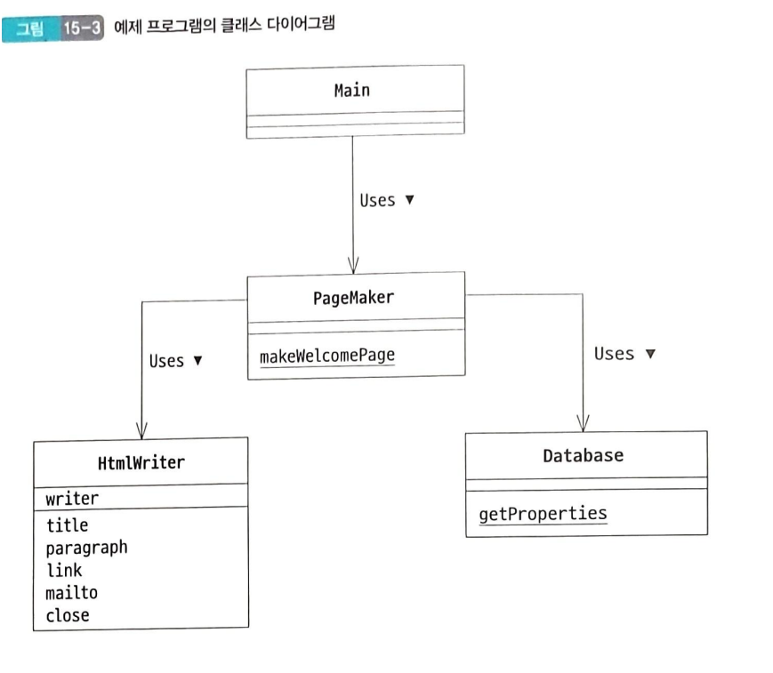
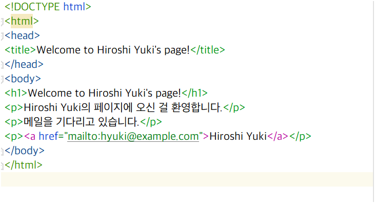
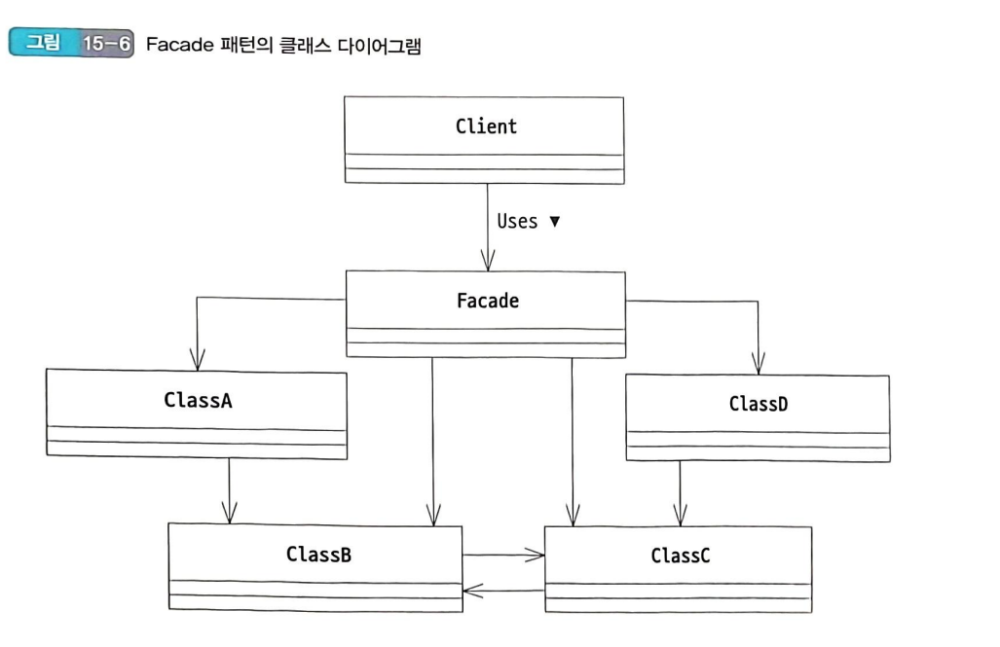
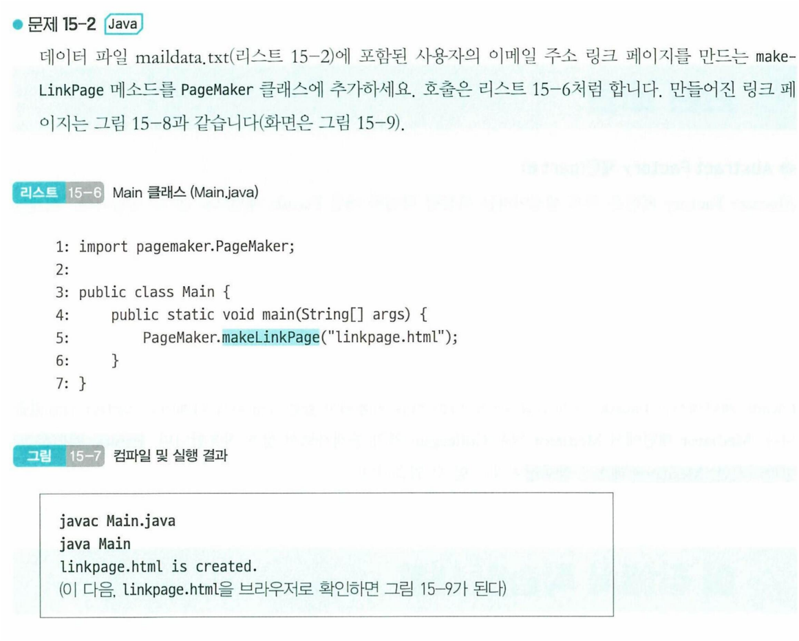
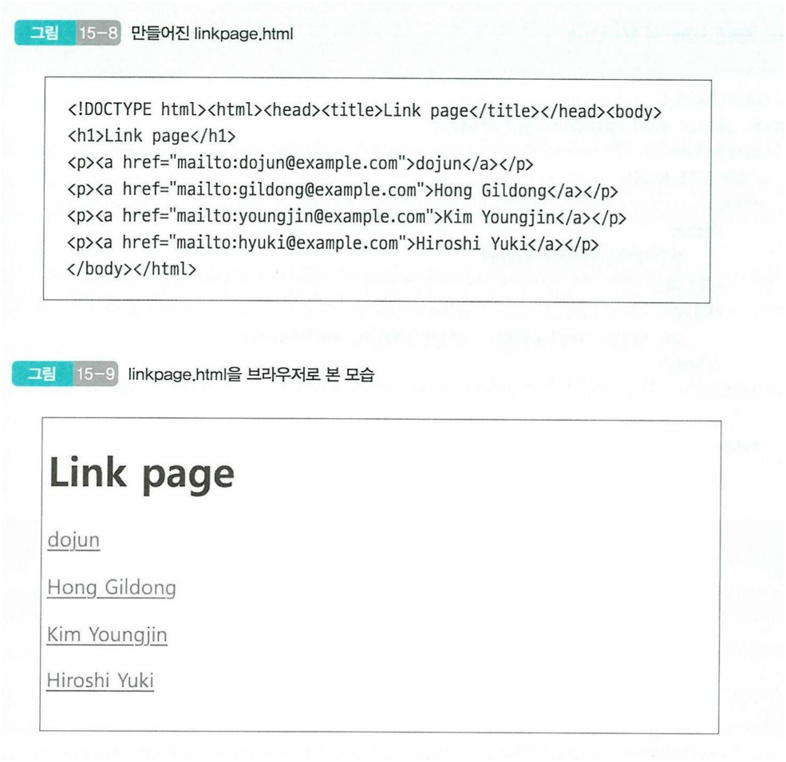

# FACADE 패턴 정리

## FACADE 패턴이란?

### 목적

- 프로그램의 복잡성 관리 및 사용자에게 단순화된 인터페이스를 제공하기 위함

### 핵심

- 복잡한 시스템의 다양한 클래스들을 하나의 `창구(Facade)`를 통해 간단하게 접근할 수 있도록함

### 용어

- `Facade` 의 경우 프랑스어 `'façade'`로 '건물의 정면'을 의미함
- 건물의 정면은 건물의 내부를 감추고 외부에게 보여지는 것이 목적이므로, `Facade` 패턴은 내부의 복잡한 시스템을 감추고 외부에게 단순한 인터페이스를 제공하는 것이 목적임

## 배경

- 프로그램의 성장과 함께 클래스의 수와 복잡성이 증가
- 클래스 간의 관계와 메서드 호출 순서를 올바르게 이해하는 것이 중요하다.
- 많은 클래스를 적절하게 제어해야 하는 상황에서 효율적인 관리가 필요한 경우

## Facade 패턴의 역할

- 간단한 인터페이스를 제공한다
    - 시스템 외부로부터 복잡한 내부 구조를 숨긴다.
    - 사용하기 쉬운 인터페이스를 제공한다.
- 클래스 사용상의 올바른 순서를 보장한다.
    - 시스템 내부의 클래스들이 올바른 순서로 작동하도록 조정할 수 있음.
- 시스템의 복잡도가 감소한다.
    - 사용자가 시스템 내부를 몰라도 사용할 수 있도록 함.

## 언제 쓰냐?

- OS 파일 시스템 접근 인터페이스 사용시
- 웹 API 복잡한 백엔드 로직을 간단한 요청으로 처리할 때
- GUI 라이브러리에서 복잡한 렌더링 과정을 간단한 함수 호출로 추상화할때

## 클래스 다이어그램



## Database 클래스

```java
package facade.pagemaker;

import java.io.FileReader;
import java.io.IOException;
import java.util.Properties;

/**
 * packageName    : facade.pagemaker
 * fileName       : Database
 * author         : ipeac
 * date           : 2024-03-25
 * description    :
 * ===========================================================
 * DATE              AUTHOR             NOTE
 * -----------------------------------------------------------
 * 2024-03-25        ipeac       최초 생성
 */
public class Database {
    //생성자를 private 으로 선언하여 인스턴스 생성을 방지한다.
    private Database() {
    }
    
    //DB 이름에서 Properties 를 얻는다.
    public static Properties getProperties(String dbName) throws IOException {
        String fileName = dbName + ".txt";
        Properties prop = new Properties();
        prop.load(new FileReader(fileName));
        return prop;
    }
}
```

- 데이터베이스 이름을 지정하여 해당하는 `Properties`를 생성하는 클래스
- java.util.Properties 클래스를 사용하여 파일로부터 데이터를 읽어옴
- Database 클래스의 경우 `Properties` 의 인스턴스를 직접 생성하지 않고, `getProperties` static 메서드를 통하여 `Properties` 인스턴스를 얻는다.

### SOLID , Clean Code , effective java

- Database 클래스는 데이터 파일로부터 `Properties` 객체를 생성하는 단일 책임을 가진다.
- 클린코드의 원칙에 따라 메서드와 클래스의 목적이 명확하다
- 또한 Effective Java의 원칙에 따라 객체 생성을 제한하고, static 메서드를 통해 인스턴스를 생성한다.

## HtmlWriter 클래스

```java
package facade.pagemaker;

import java.io.FileNotFoundException;
import java.io.IOException;
import java.io.UnsupportedEncodingException;
import java.io.Writer;

/**
 * packageName    : facade.pagemaker
 * fileName       : HtmlWriter
 * author         : ipeac
 * date           : 2024-03-25
 * description    :
 * ===========================================================
 * DATE              AUTHOR             NOTE
 * -----------------------------------------------------------
 * 2024-03-25        ipeac       최초 생성
 */
public class HtmlWriter {
    private Writer writer;
    
    public HtmlWriter(Writer writer) throws FileNotFoundException, UnsupportedEncodingException {
        this.writer = writer;
    }
    
    //타이틀 출력
    public void title(String title) throws IOException {
        //제목 출력
        writer.write("<!DOCTYPE html>\n");
        writer.write("<html>\n");
        writer.write("<head>\n");
        writer.write("<title>" + title + "</title>\n");
        writer.write("</head>\n");
        writer.write("<body>\n");
        writer.write("<h1>" + title + "</h1>\n");
    }
    
    //단락 출력
    public void paragraph(String msg) throws IOException {
        writer.write("<p>" + msg + "</p>\n");
    }
    
    //링크 출력
    public void link(String href, String caption) throws IOException {
        paragraph("<a href=\"" + href + "\">" + caption + "</a>");
    }
    
    //메일 주소 출력
    public void mailto(String mailaddr, String username) throws IOException {
        link("mailto:" + mailaddr, username);
    }
    
    //클로즈
    public void close() throws IOException {
        writer.write("</body>\n");
        writer.write("</html>\n");
        writer.close();
    }
}
```

## PageMaker 클래스

```java
package facade.pagemaker;

import java.io.FileOutputStream;
import java.io.IOException;
import java.io.OutputStreamWriter;
import java.nio.charset.StandardCharsets;
import java.util.Properties;

/**
 * packageName    : facade.pagemaker
 * fileName       : PageMaker
 * author         : ipeac
 * date           : 2024-03-25
 * description    :
 * ===========================================================
 * DATE              AUTHOR             NOTE
 * -----------------------------------------------------------
 * 2024-03-25        ipeac       최초 생성
 */
public class PageMaker {
    private PageMaker() {
    }
    
    public static void makeWelcomePage(String mailaddr, String filename) {
        try {
            Properties mailprop = Database.getProperties("maildata");
            String username = mailprop.getProperty(mailaddr);
            
            HtmlWriter writer = new HtmlWriter(new OutputStreamWriter(new FileOutputStream(filename), StandardCharsets.UTF_8));
            
            writer.title("Welcome to " + username + "'s page!");
            writer.paragraph(username + "의 페이지에 오신 걸 환영합니다.");
            writer.paragraph("메일을 기다리고 있습니다.");
            writer.mailto(mailaddr, username);
            writer.close();
            System.out.println(filename + " is created for " + mailaddr + " (" + username + ")");
        } catch (IOException e) {
            e.printStackTrace();
        }
    }
}
```

- `Database` 클래스와 `HtmlWriter` 클래스를 조합하여 사용자의 웹 페이지를 생성하는 역할을 한다.
- `Facade` 패턴의 핵심으로, 복잡한 내부 로직을 숨기고 사용자에게 단순한 인터페이스를 제공한다.

## Main 문 실행



## Facade 패턴의 등장인물

1. Facade(정면) 역

    - 시스템을 구성하는 그 밖의 많은 역을 위한 `단순한 창구`
    - 시스템을 구성하는 여러 컴포넌트에 대해 복잡한 상호작용을 캡슐화하고, 사용자에게 필요한 기능만을 단순화된 형태로 제공한다.
    - `PageMaker` 가 `Facade` 역할을 한다.

2. 시스템을 구성하는 그 밖의 많은 배역

    - 시스템의 구체적인 기능인 담당하는 컴포넌트이다.
    - 각자의 역할에 집중하며 `Facade` 를 통해 외부와의 상호작용을 한다.
    - 해당 컴포넌트들은 `Facade` 를 통하지 않고 직접 사용되는 경우 시스템의 복잡성이 그대로 노출됨.
    - `Database` 와 `HtmlWriter` 가 해당 역할을 한다.

3. Client(의뢰자)

    - `Facade` 를 통해 시스템의 기능을 사용하는 사용자
    - `PageMaker` 를 통해 사용자는 복잡한 내부 로직을 알 필요 없이 웹 페이지를 생성할 수 있다.
    - `Main` 이 해당 역할을 한다.



## Facade 패턴의 역할

1. 복잡성의 감소

2. 인터페이스의 수 줄이기

    - 시스템을 사용하기 위하여 필요한 API 의 수를 줄인다.
    - 클래스와 메서드가 너무 많은 경우 사용자가 어떤 것을 사용해야 하는지 헷갈릴 수 있으며, 호출 순서레도 주의해야한다.
    - `Facade` 를 통하여 필요한 기능만을 제공하는 단순화된 인터페이스를 제공

3. 결합도 감소

    - 인터페이스가 적다는 것은 외부와의 결합이 느슨하다는 것을 의미한다.
    - 이는 패키지나 클래스를 다른 시스템이나 모듈에서 재사용하기 쉽게 만든다.

4. 유지보수성의 향상

    - 너무 많은 메서드나 필드를 `public` 으로 선언하게 되면, 다른 클래스가 해당 필드의 내용을 마음대로 참조하거나 변경할 수 있어서
    - 클래스를 수정하기가 어려워진다.
    - `Facade` 를 통해 외부에 노출되는 필드나 메서드를 제한함으로써, 클래스의 내부 구조를 변경해도 외부에 영향을 미치지 않도록 한다.

## 관련된 디자인 패턴

1. `Abstract Factory 패턴`

2. `Singleton 패턴`

3. `Mediator 패턴`

## 문제

1. 클래스 설계자는 앞으로의 확장이나 프로그램 개선에 대비해 PageMaker 클래스만 pagemaker 패키지 밖
   에서 이용할 수 있게 만들고 싶습니다. Database 클래스와 HtmlWriter 클래스를 pagemaker 패키지 밖에
   서 이용할 수 없게 하려면 예제 프로그램을 어떻게 변경해야 할까요?

    - 내가 생각하는 답변 : 접근제한자 관련 질문같다. Database 클래스와 HtmlWriter 클래스의 접근제한자를 `package-private` 으로 변경하면 된다.
    - Java 의 경우 별도 접근제한자를 명시하지 않는 경우 패키지 레벨의 접근제한을 가지게 된다.

2. 데이터 파일 maildata.txt(리스트 15-2)에 포함된 사용자의 이메일 주소 링크 페이지를 만드는 makeLinkPage 메소드를 PageMaker 클래스에 추가하세요. 호출은 리스트 15-6처럼 합니다.
   만들어진 링크 페이지는 그림 15-8과 같습니다(화면은 그림 15-9).
   
   

   ```java 
   public static void makeLinkPage(String fileName) {
        try {
            Properties mailprop = Database.getProperties("maildata");
            ArrayList<Object> objects = new ArrayList<>();
            HtmlWriter writer = new HtmlWriter(new FileWriter(fileName));
            writer.title("Link page");
            
            for (Map.Entry<Object, Object> objectObjectEntry : mailprop.entrySet()) {
                writer.mailto((String) objectObjectEntry.getKey(), (String) objectObjectEntry.getValue());
            }
            
            writer.close();
        } catch (IOException e) {
            e.printStackTrace();
        }
   }
   ```

3. 예제 프로그램의 HtmlWriter 클래스(리스트 15-3)에서는 HTML을 기술하기 위해서 많은 문자열 리터
럴(""로 묶인 문자열)이 등장했습니다. 그런데 Java에는 여러 줄에 걸친 문자열 리터럴을 읽기 쉽게 기
술하기 위한 텍스트 블록(text block)이 있습니다. 그 예를 살펴보겠습니다.
텍스트 블록은 리스트 15-7처럼 큰따옴표 3개를 짝을 지어 만듭니다. 텍스트 블록을 시작하는 직후
에 행을 바꾸고, 그 다음 행부터 텍스트 블록이 끝나는 "''''까지를 문자열로 취급합니다. 단, 각 행 시작
부분의 공백은 종료를 나타내는 "'''의 들여쓰기 위치에 맞춰 무시됩니다. 텍스트 블록 안의 "를 "처럼
쓸 필요가 없습니다. 리스트 15-7을 실행하면 어떻게 출력될까요?